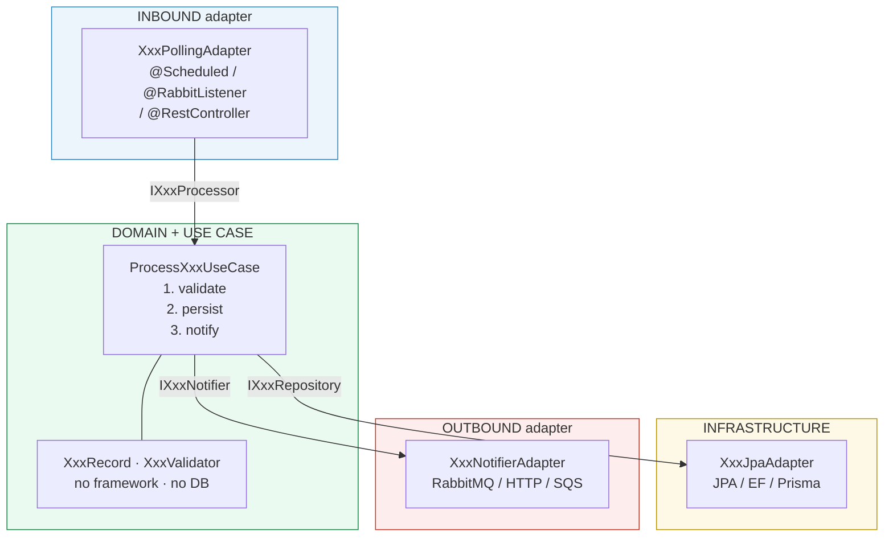
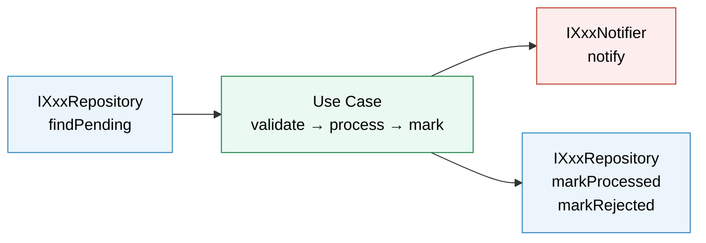

# Socket Pattern — Backend

> The same socket principle applied server-side: every boundary between the trigger,
> the domain, and the infrastructure is an explicit interface contract.

---

## Structure (always the same)



---

## Java / Spring Boot example

### Contracts (the sockets)

```java
// IOrderProcessor.java
public interface IOrderProcessor {
    int process();
}

// IOrderRepository.java
public interface IOrderRepository {
    void save(Order order);
    List<Order> findPending(int limit);
    void markProcessed(String orderId);
    void markRejected(String orderId, String reason);
}

// IOrderNotifier.java
public interface IOrderNotifier {
    void notify(Order order);
}
```

### Domain (zero framework imports)

```java
public record Order(
    String id,
    String customerId,
    List<String> items,
    BigDecimal total,
    LocalDateTime createdAt
) {}

public final class OrderValidator {
    private OrderValidator() {}

    public static boolean isValid(Order order) {
        if (order == null || order.id() == null || order.id().isBlank()) return false;
        if (order.items() == null || order.items().isEmpty()) return false;
        if (order.total() == null || order.total().compareTo(BigDecimal.ZERO) <= 0) return false;
        return true;
    }
}
```

### Use Case (no Spring, no JPA — testable with plain mocks)

```java
@RequiredArgsConstructor
@Slf4j
public class ProcessOrderUseCase implements IOrderProcessor {

    private final IOrderRepository repository;
    private final IOrderNotifier notifier;
    private final int batchSize;

    @Override
    public int process() {
        List<Order> pending = repository.findPending(batchSize);
        if (pending.isEmpty()) return 0;

        int processed = 0;
        for (Order order : pending) {
            try {
                if (!OrderValidator.isValid(order)) {
                    repository.markRejected(order.id(), "Invalid order data");
                    continue;
                }
                notifier.notify(order);
                repository.markProcessed(order.id());
                processed++;
            } catch (Exception e) {
                log.error("Failed to process order id={}", order.id(), e);
                repository.markRejected(order.id(), e.getMessage());
            }
        }
        return processed;
    }
}
```

### Inbound adapter — polling

```java
@Component
@RequiredArgsConstructor
@ConditionalOnProperty(name = "orders.polling.enabled", havingValue = "true", matchIfMissing = true)
public class OrderPollingAdapter {

    private final IOrderProcessor processor; // interface, not concrete class

    @Scheduled(cron = "${orders.polling.cron:0 */5 * * * *}")
    public void poll() {
        processor.process();
    }
}
```

### Outbound adapter — swap without touching the use case

```java
// RabbitMQ plug
@Component
@ConditionalOnProperty(name = "orders.notifier", havingValue = "rabbitmq", matchIfMissing = true)
public class OrderRabbitNotifier implements IOrderNotifier {
    private final RabbitTemplate rabbit;

    @Override
    public void notify(Order order) {
        rabbit.convertAndSend("orders.exchange", "orders.processed", order);
    }
}

// HTTP webhook plug — same socket, different internals
@Component
@ConditionalOnProperty(name = "orders.notifier", havingValue = "webhook")
public class OrderWebhookNotifier implements IOrderNotifier {
    private final RestClient restClient;

    @Override
    public void notify(Order order) {
        restClient.post().uri("/webhook/orders").body(order).retrieve().toBodilessEntity();
    }
}
```

Set `orders.notifier=webhook`. Done. Zero changes to `ProcessOrderUseCase`.

### Config (wires interfaces — never concrete classes)

```java
@Configuration
@EnableScheduling
public class OrderConfig {

    @Bean
    public IOrderProcessor processOrderUseCase(
            IOrderRepository repository,
            IOrderNotifier notifier,
            @Value("${orders.polling.batch-size:50}") int batchSize) {
        return new ProcessOrderUseCase(repository, notifier, batchSize);
    }
}
```

### Tests (no Spring context — milliseconds)

```java
@ExtendWith(MockitoExtension.class)
class ProcessOrderUseCaseTest {

    @Mock IOrderRepository repository;
    @Mock IOrderNotifier notifier;
    ProcessOrderUseCase useCase;

    @BeforeEach
    void setUp() {
        useCase = new ProcessOrderUseCase(repository, notifier, 100);
    }

    @Test
    void validOrder_notifiesAndMarksProcessed() {
        var order = new Order("ord-1", "cust-1", List.of("item-a"), BigDecimal.TEN, LocalDateTime.now());
        when(repository.findPending(100)).thenReturn(List.of(order));

        assertThat(useCase.process()).isEqualTo(1);
        verify(notifier).notify(order);
        verify(repository).markProcessed("ord-1");
    }

    @Test
    void invalidOrder_rejectsWithoutNotifying() {
        var order = new Order(null, "cust-1", List.of(), BigDecimal.ZERO, LocalDateTime.now());
        when(repository.findPending(100)).thenReturn(List.of(order));

        assertThat(useCase.process()).isZero();
        verifyNoInteractions(notifier);
    }
}
```

---

## C# / ASP.NET Core example

### Contracts

```csharp
public interface IOrderProcessor
{
    Task<int> ProcessAsync(CancellationToken ct = default);
}

public interface IOrderRepository
{
    Task<IEnumerable<Order>> FindPendingAsync(int limit, CancellationToken ct = default);
    Task MarkProcessedAsync(string orderId, CancellationToken ct = default);
    Task MarkRejectedAsync(string orderId, string reason, CancellationToken ct = default);
}

public interface IOrderNotifier
{
    Task NotifyAsync(Order order, CancellationToken ct = default);
}
```

### Use Case

```csharp
public class ProcessOrderUseCase : IOrderProcessor
{
    private readonly IOrderRepository _repository;
    private readonly IOrderNotifier _notifier;
    private readonly int _batchSize;

    public ProcessOrderUseCase(IOrderRepository repository, IOrderNotifier notifier, int batchSize)
    {
        _repository = repository;
        _notifier = notifier;
        _batchSize = batchSize;
    }

    public async Task<int> ProcessAsync(CancellationToken ct = default)
    {
        var pending = await _repository.FindPendingAsync(_batchSize, ct);
        int processed = 0;

        foreach (var order in pending)
        {
            try
            {
                if (!OrderValidator.IsValid(order))
                {
                    await _repository.MarkRejectedAsync(order.Id, "Invalid order data", ct);
                    continue;
                }
                await _notifier.NotifyAsync(order, ct);
                await _repository.MarkProcessedAsync(order.Id, ct);
                processed++;
            }
            catch (Exception ex)
            {
                await _repository.MarkRejectedAsync(order.Id, ex.Message, ct);
            }
        }
        return processed;
    }
}
```

### Wiring (Program.cs)

```csharp
builder.Services.AddScoped<IOrderRepository, OrderEfRepository>();
builder.Services.AddScoped<IOrderNotifier, OrderServiceBusNotifier>();
builder.Services.AddScoped<IOrderProcessor>(sp =>
    new ProcessOrderUseCase(
        sp.GetRequiredService<IOrderRepository>(),
        sp.GetRequiredService<IOrderNotifier>(),
        batchSize: 50));
```

Swap `OrderServiceBusNotifier` for `OrderHttpNotifier` — one line change. Use case untouched.

---

## TypeScript / Node.js example

### Contracts

```ts
export interface IOrderProcessor {
  process(): Promise<number>;
}

export interface IOrderRepository {
  findPending(limit: number): Promise<Order[]>;
  markProcessed(orderId: string): Promise<void>;
  markRejected(orderId: string, reason: string): Promise<void>;
}

export interface IOrderNotifier {
  notify(order: Order): Promise<void>;
}
```

### Use Case

```ts
export class ProcessOrderUseCase implements IOrderProcessor {
  constructor(
    private readonly repository: IOrderRepository,
    private readonly notifier: IOrderNotifier,
    private readonly batchSize: number,
  ) {}

  async process(): Promise<number> {
    const pending = await this.repository.findPending(this.batchSize);
    let processed = 0;

    for (const order of pending) {
      try {
        if (!OrderValidator.isValid(order)) {
          await this.repository.markRejected(order.id, 'Invalid order data');
          continue;
        }
        await this.notifier.notify(order);
        await this.repository.markProcessed(order.id);
        processed++;
      } catch (err) {
        await this.repository.markRejected(order.id, (err as Error).message);
      }
    }
    return processed;
  }
}
```

### Test (Jest — no DB, no broker)

```ts
describe('ProcessOrderUseCase', () => {
  it('notifies and marks processed for valid order', async () => {
    const repository = { findPending: jest.fn(), markProcessed: jest.fn(), markRejected: jest.fn() };
    const notifier = { notify: jest.fn() };
    const useCase = new ProcessOrderUseCase(repository as any, notifier as any, 10);

    repository.findPending.mockResolvedValue([validOrder]);

    expect(await useCase.process()).toBe(1);
    expect(notifier.notify).toHaveBeenCalledWith(validOrder);
    expect(repository.markProcessed).toHaveBeenCalledWith(validOrder.id);
  });
});
```

---

## The key insight

The use case in all three languages is **identical in structure**:



The language changes. The framework changes. The structure does not.
That is the point.
