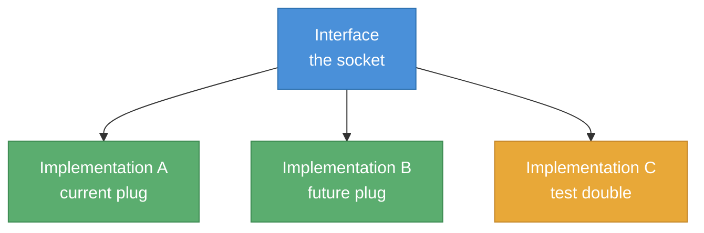

# Socket Pattern

> *"Define the contract first. Any implementation that fits the contract works — regardless of what's inside."*

A pragmatic approach to **decoupled, testable, and replaceable code** — applicable at any layer, in any language, in any framework.

---

## What is it?

Socket Pattern is a **code architecture practice** — not a software architecture.

It does not define how your services communicate, how they deploy, or how they scale.
It defines how the **code inside a module is organised** so that any piece can be replaced without breaking anything else.

The name comes from a simple analogy:

- The **interface** is the socket — it defines the shape
- The **implementation** is the plug — it must conform to that shape
- Any plug that fits the socket works, regardless of what's inside

---

## The one rule

> **Every boundary between layers must be an explicit interface contract.**

Not just at the infrastructure boundary (as in classic Hexagonal Architecture) — at **every** boundary:
- Between the trigger (polling, webhook, REST) and the use case
- Between the use case and persistence
- Between the use case and messaging/external systems
- Between the UI and the data layer
- Between the UI template and the component logic

---

## Why it works

### 1. The domain never knows who calls it or what it calls

The use case (or ModelView in UI) depends only on interfaces. It has zero knowledge of:
- Whether the data comes from polling, a REST call, or a queue
- Whether persistence is Postgres, Oracle, or an in-memory map
- Whether notifications go to RabbitMQ, HTTP, or nowhere (in tests)

This is the **Dependency Inversion Principle** applied consistently, not just at the infrastructure boundary.

### 2. Tests are trivial

Because the use case depends only on interfaces, you test it with plain mocks — no Spring context, no database, no broker. Fast, deterministic, no setup.

### 3. Mechanical changes become configuration changes

Swapping a database, a messaging system, or an inbound protocol becomes:
1. Write a new adapter implementing the existing interface
2. Register it in the DI config
3. Done — the use case is untouched

### 4. Onboarding is fast

The structure is always the same. A developer new to the codebase can navigate to any module and immediately understand:
- What comes in (inbound adapter)
- What the rules are (use case / domain)
- Where things go (outbound adapter / infrastructure)

---

## Advantages

| Advantage | Why |
|---|---|
| **Replaceability** | Any adapter can be swapped without touching the domain |
| **Testability** | Use case has no framework imports — mocks are trivial |
| **Parallel development** | Teams can work on adapters independently once interfaces are agreed |
| **Explicit dependencies** | Every dependency is visible in the constructor — no hidden coupling |
| **Incremental adoption** | Apply to one module at a time — no big bang refactor needed |
| **Language agnostic** | Works in Java, C#, TypeScript, Python, Swift — wherever interfaces exist |
| **Layered protection** | Changing a protocol, database, or broker never ripples into business logic |

---

## Disadvantages

| Disadvantage | When it matters |
|---|---|
| **More files** | Each module has contracts, use case, and adapters — more boilerplate than a simple CRUD service |
| **Over-engineering risk** | For simple, stable modules with no expected change, the overhead is not justified |
| **Interface proliferation** | If applied blindly to everything, you end up with interfaces that have only one implementation and never change |
| **Learning curve** | Developers unfamiliar with DI and interface-based design need time to adapt |
| **Not a silver bullet** | Does not solve distributed systems concerns, service communication, or deployment complexity |

**Rule of thumb:** apply it where change is expected or where testability matters. Skip it for trivial CRUD with no business logic.

---

## Relationship to existing patterns

| Pattern | Relationship |
|---|---|
| **Dependency Inversion Principle (SOLID)** | Socket Pattern is DIP applied consistently at every boundary, not just infrastructure |
| **Hexagonal / Ports & Adapters** | Hexagonal defines ports at the application boundary. Socket Pattern applies the same idea at module/feature level — more granular |
| **Clean Architecture** | Similar layering philosophy. Socket Pattern adds explicit naming for UI ports (frontend) and is more prescriptive about granularity |
| **Strategy Pattern (GoF)** | Strategy is a single behavioural swap. Socket Pattern is a structural approach applied across all layers |
| **Repository Pattern** | `IOrderRepository` is a socket. The JPA/EF/Prisma adapter is a plug. Socket Pattern generalises this to every layer |
| **MVVM** | Socket Pattern splits the ViewModel into ModelView (data) and ViewController (UI) with an explicit `IView` port between them |

---

## What it is NOT

- Not a replacement for software architecture (microservices, monolith, event-driven)
- Not Domain-Driven Design — it does not prescribe how to model the domain
- Not a new idea — it is a synthesis of DIP, Hexagonal, and SOLID with a clearer metaphor and more consistent application
- Not mandatory everywhere — use judgment

---

## Frontend vs Backend

The pattern applies equally to both layers but manifests differently:

| | Frontend | Backend |
|---|---|---|
| **Inbound** | User action / route | Polling / webhook / queue |
| **Domain** | ModelView + ViewController | Use Case |
| **Outbound** | API calls | DB / messaging / HTTP |
| **Interface examples** | `IOrderView`, `IOrderController` | `IOrderRepository`, `IOrderNotifier` |
| **Test double** | In-memory ViewModel | Mock repository/notifier |

→ See [README-frontend.md](./README-frontend.md) for the UI implementation  
→ See [README-backend.md](./README-backend.md) for the backend implementation

---

## History

This pattern emerged from practice — not from theory.

It was first applied in 2011 during university projects in C#, as a way to make code replaceable and testable without a testing framework. Over the following years it was validated across multiple production projects in different languages and domains.

The formalisation into "Socket Pattern" came later, when trying to explain the approach to other developers in a way that was immediately intuitive — "interface as socket, implementation as plug" resonated where "ports and adapters" did not.

It is not a new invention. It is a consistent, pragmatic application of ideas that have existed since the early 2000s — with a metaphor that makes them accessible to any developer, not just those who have read the literature.
