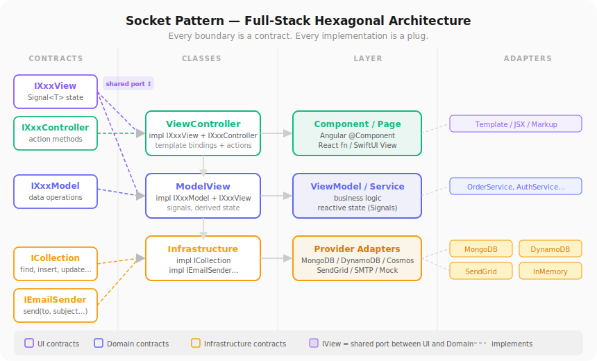

# Socket Pattern

> **Full-Stack Hexagonal UI Architecture** — every boundary between layers is defined by an explicit interface contract before any implementation is written.



---

## The Idea

Named after the USB socket analogy: the **interface is the socket** (defines the shape), the **implementation is the plug** (must conform to that shape). Any plug that fits works — regardless of what's inside.

The result is an architecture where you can swap MongoDB for DynamoDB, a REST service for an in-memory mock, or a full page component for a test double — without changing a single line outside the adapter.

This is an extension of **Ports & Adapters (Hexagonal Architecture)** applied symmetrically across all layers — not just infrastructure, but also domain and UI.

---

## The Three Contracts

Every screen defines three interfaces before any code is written:

```ts
// What data the screen needs from persistence
interface IOrderModel {
  fetchOrders(userId: string): Promise<Order[]>;
  saveOrder(data: CreateOrder): Promise<Order>;
}

// The reactive state the template is allowed to read  ← shared port
interface IOrderView {
  readonly orders: Signal<Order[]>;
  readonly loading: Signal<boolean>;
  readonly isEmpty: Signal<boolean>;   // derived state
  readonly canCreate: Signal<boolean>; // derived from role
}

// The actions the template is allowed to trigger
interface IOrderController {
  load(): void;
  create(data: CreateOrder): void;
  remove(id: string): void;
}
```

---

## The Two Classes

Each screen has exactly two implementation classes, connected by `IXxxView`:

```
IModel  ──┐
           ├──► ModelView       (owns data fetching + reactive state)
IView   ──┤
           │
IView   ──┤
           ├──► ViewController  (owns template bindings + user actions)
IController ──┘
```

### ModelView

Implements `IModel + IView`. Pure class — no UI framework dependency. Knows how to get data, transforms it into reactive state. Fully testable without a DOM.

```ts
class OrderViewModel implements IOrderView {
  private readonly model = inject(OrderService); // IOrderModel

  readonly orders  = signal<Order[]>([]);
  readonly loading = signal(false);
  readonly isEmpty  = computed(() => this.orders().length === 0 && !this.loading());
  readonly canCreate = computed(() => this.auth.role() === 'admin');
}
```

### ViewController

Implements `IView + IController`. Thin component — delegates all state to the ModelView, handles user events. Almost no logic of its own.

```ts
@Component({ providers: [OrderViewModel] }) // scoped lifecycle
class OrdersPage implements IOrderController {
  private readonly vm = inject(OrderViewModel); // via IOrderView

  readonly orders    = this.vm.orders;
  readonly isEmpty   = this.vm.isEmpty;
  readonly canCreate = this.vm.canCreate;

  create(data: CreateOrder): void { ... }
  remove(id: string): void { ... }
}
```

### View (template)

Only uses names declared in `IXxxView` and `IXxxController`. Zero logic.

```html
@if (loading()) { <app-spinner /> }
@else if (isEmpty()) { <p>No orders yet.</p> }
@else {
  @for (order of orders(); track order.id) {
    <app-order-card [order]="order" (remove)="remove(order.id)" />
  }
}
@if (canCreate()) {
  <button (click)="create(form.value)">New order</button>
}
```

---

## Infrastructure Contracts

The same principle applies below the domain layer. Define the interface for any external dependency, then implement it per provider:

```ts
interface ICollection<T> {
  findOne(filter: Partial<T>): Promise<T | null>;
  find(filter: Partial<T>): Promise<T[]>;
  insertOne(doc: Omit<T, 'id'>): Promise<{ id: string }>;
  updateOne(filter: Partial<T>, update: Partial<T>): Promise<{ updated: boolean }>;
  deleteOne(filter: Partial<T>): Promise<{ deleted: boolean }>;
}

// Adapters — all implement ICollection<T>
class MongoCollection<T> implements ICollection<T> { ... }
class DynamoCollection<T> implements ICollection<T> { ... }
class InMemoryCollection<T> implements ICollection<T> { ... } // for tests
```

Switching from MongoDB to DynamoDB is a single config change (`DB_PROVIDER=dynamo`), not a refactor.

---

## Full Stack View

```
┌─────────────────────────────────────────────────────────────┐
│  Template / Markup                     (View — zero logic)  │
├──────────────────────── IXxxView ───────────────────────────┤  ← UI port
│  ViewController   (IXxxView + IXxxController)               │
├──────────────────────── IXxxView ───────────────────────────┤  ← shared port
│  ModelView        (IXxxModel + IXxxView)                    │
├──────────────────────── IXxxModel ──────────────────────────┤  ← domain port
│  Service layer    (business logic)                          │
├──────────────────────── ICollection ────────────────────────┤  ← infra port
│  MongoDB / DynamoDB / CosmosDB / InMemory                   │
└─────────────────────────────────────────────────────────────┘
```

---

## Framework Fit

| Framework | Fit | Notes |
|---|---|---|
| **React (hooks)** | ★★★★★ | Hook = ModelView, component = ViewController. Scoped by default, no singleton concern. |
| **SwiftUI** | ★★★★★ | `@StateObject` is ModelView. `View` struct is ViewController. Native fit. |
| **Jetpack Compose** | ★★★★★ | Jetpack `ViewModel` + `@Composable`. Designed for this. |
| **Vue 3 (composables)** | ★★★★☆ | `useXxx()` = ModelView. Same as React hooks. |
| **Angular 22 (signals)** | ★★★★☆ | Works well. Use `providers: [XxxViewModel]` on the component to avoid singleton state. |
| **C# Blazor / MAUI** | ★★★★★ | MVVM is native. Real interface injection via DI container. |

---

## Rules

1. **Contracts before implementation** — write `*.contracts.ts` (or equivalent) first.
2. **IView is read-only in the interface** — declare as `Signal<T>`, not `WritableSignal<T>`.
3. **No logic in templates** — every conditional or derivation is a `computed()` in the ModelView.
4. **ModelView has no UI imports** — it must be testable without a DOM or component tree.
5. **ViewController has no business logic** — it delegates everything to the ModelView.
6. **Infrastructure interfaces stay simple** — define only what CRUD operations are guaranteed. Provider-specific features (aggregations, transactions) go in extended interfaces.
7. **Lifecycle is explicit** — in frameworks with a DI container, scope the ModelView to the component's lifetime, not the application.

---

## Naming Conventions

| Thing | Convention | Example |
|---|---|---|
| Model interface | `IXxxModel` | `IOrderModel` |
| View interface | `IXxxView` | `IOrderView` |
| Controller interface | `IXxxController` | `IOrderController` |
| Contracts file | `xxx.contracts.ts` | `orders.contracts.ts` |
| ModelView class | `XxxViewModel` | `OrderViewModel` |
| ViewController class | `XxxPage` / `XxxScreen` | `OrdersPage` |
| Infrastructure interface | `ICollection`, `IEmailSender` | — |
| Computed booleans | Descriptive | `isEmpty`, `canCreate`, `showList` |

---

## Relationship to Existing Patterns

| Pattern | Relationship |
|---|---|
| **Hexagonal / Ports & Adapters** | Socket Pattern extends this to the UI layer |
| **MVVM** | Socket Pattern splits the ViewModel into ModelView + ViewController |
| **Repository Pattern** | `ICollection` is a repository port |
| **Clean Architecture** | Similar layering; Socket Pattern names the UI ports explicitly |
| **MVC** | Not MVC — no separate Controller class; actions live in the ViewController |
